<!-- ===========================================================
                            PRESENTACIÓN 
     =========================================================== -->

   

***

***

 ## Tabla de Contenidos:
 
- [Generador de Memes](#generador-de-memes)
- [Tecnologías](#tecnologías)
- [Construcción](#construcción)
- [Secciones y Paneles](#secciones-y-paneles)
- [Mobile](#mobile)
- [Contáctame](#contáctame)

---
 

<!-- ==================================================
                         CONTENIDO 
     ================================================== -->

## *Generador de Memes*

[:top:](#tabla-de-contenidos)  

> Las aplicaciones web, comúnmente conocidas como apps, se han convertido en una parte esencial de nuestra vida cotidiana. Desde simplificar tareas diarias hasta ofrecer entretenimiento.  
El `Generador de Memes` es una app web, que permite que cualquier usuario pueda plasmar toda su creatividad al diseñar sus propios memes. 
El Generador de Memes permite añadir imágenes propias o de la web, para crear memes personalizados, editando el texto elegido además de aplicar diferentes filtros. Por último, permite guardar el meme creado y compartirlo con los amigos.

   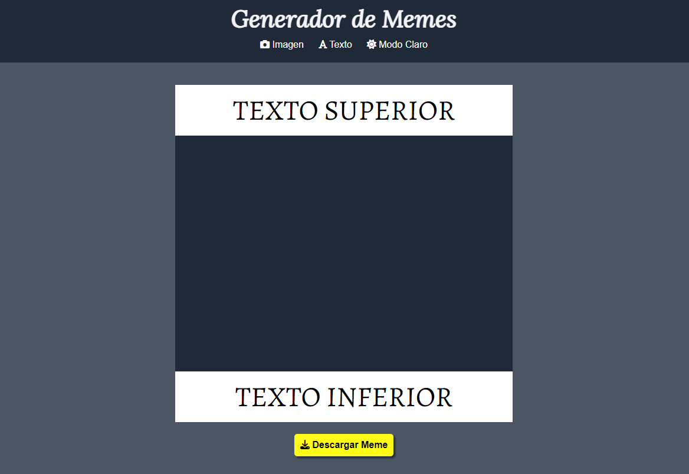

El `Generador de Memes`, fue diseñado de tal manera que puede ser utilizado en diferentes dispositivos, lo que implica un correcto diseño responsive. 

   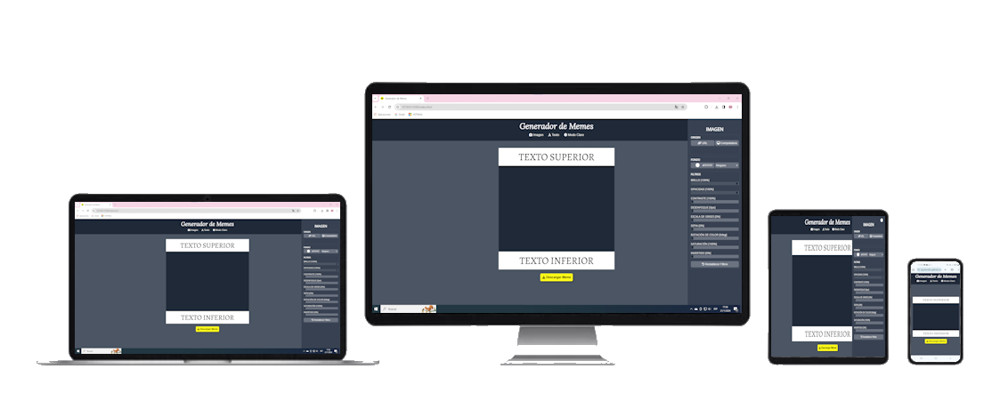

 

Fue desarrollado como Trabajo Final del "Módulo 2 - JavaScript", de la capacitación de `"Desarrollo Frontend"` dictado por [ADA ITW](https://www.linkedin.com/school/ada-itw/), y se encuentra incluido en mi `Portfolio Personal`, de tal manera de reflejar el grado de avance, apropiación y uso de los conocimiento adquiridos y asimilados durante la capacitación.

> [!NOTE]
> Visite mi portafolio personal: [PORTFOLIO](https://maguibrollo.github.io/ADA_Portafolio_mod01_tf/).

 

## *Tecnologías*
[:top:](#tabla-de-contenidos)  
EL Generador de Memes fue desarrollado utilizando las siguientes tecnologías:  

|   |    |  |  
| :---: | :---: | :---: |
|Lenguaje de marcado de hipertexto. Consiste en marcas basado en etiquetas que otorgan la estructura básica de la app.| Hojas de estilo en cascada. Son las declaraciones que otorgan estilos visuales al HTML.  | Lenguaje de programación. Otorga interactividad a las distintas secciones que conforman la app.|

 

## *Construcción*
[:top:](#tabla-de-contenidos)  
El Generador de Memes, presenta una pantalla principal que contiene tres botones que permiten abrir el panel de edición de `Imagen`, abrir el panel de edición de `Texto`, e intercambiar entre `Modo claro` y `Modo Oscuro`. 
 

   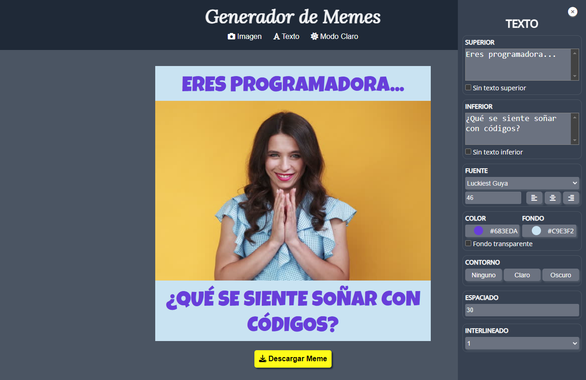

Luego de realizar todos los ajustes deseados es posible descargar el meme generado, mediante en botón `Descargar Meme`.
 

   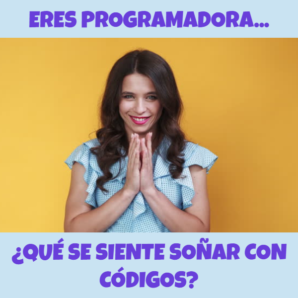

 

---

## *Secciones y Paneles*
[:top:](#tabla-de-contenidos)  

- [Principal](#sección-principal)
- [Imagen](#panel-de-imagen)
- [Texto](#panel-de-texto)

#### Sección Principal
[:top:](#secciones-y-paneles)  
Al abrir la app, si el tamaño de la pantalla del dispositivo utilizado, es superior a 1300px, se verá el [Panel de Imagen](#panel-de-imagen), de lo contrario se podrá activar dicho panel, o el [Panel de Texto](#panel-de-texto), mediante el botón correspondiente.  
La visualización se realiza por defecto en Modo Oscuro, pudiendo ser cambiada con el botón correspondiente.

|MODO OSCURO| MODO CLARO|
| :---: | :---: |
|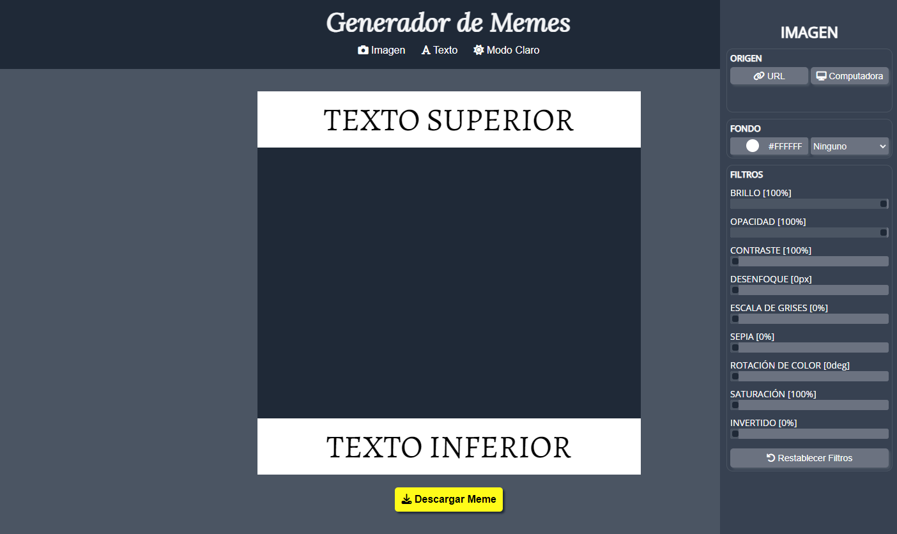| 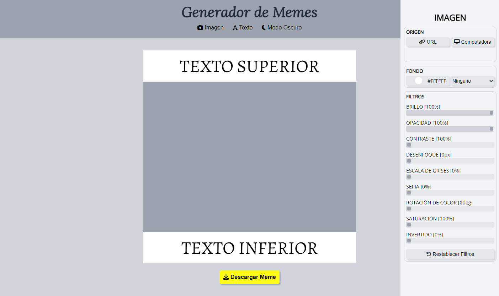|

El botón `Descargar Meme`, permitirá descargar, al dispositivo utilizado, el meme en formato *.PNG.

 

---

#### Panel de Imagen
[:top:](#secciones-y-paneles)

   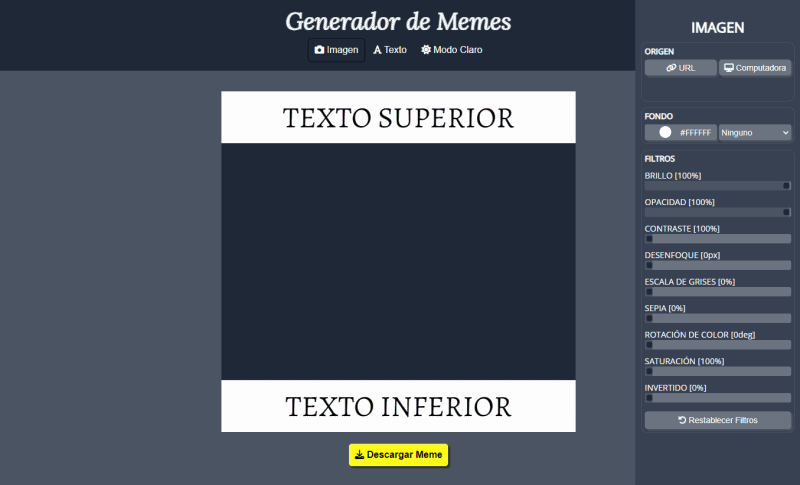

Mediante el panel de imagen se podrá editar:
- Origen: permite seleccionar el origen de la imagen, que puede ser, por URL o buscar un archivo almacenado en el dispositivo utilizado.
-  Fondo: permite seleccionar el color de fondo, y el modo de mezcla (blend mode) para calcular el color final de la imagen teniendo en cuenta el color seleccionado.
- Filtros: permite aplicar diferentes filtros sobre la imagen, de manera individual o varios simultáneamente.

 

---

#### Panel de Texto
[:top:](#secciones-y-paneles)

   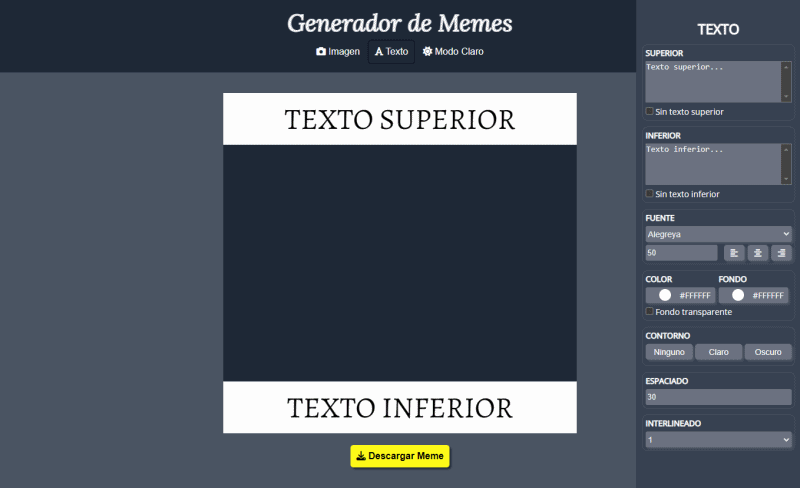

Mediante el panel de texto se podrá editar:
- Texto superior e inferior: permite escribir una breve frase, o bien optar por no incluir frase.
- Fuente: permite seleccionar tipos de fuente, tamaño y alineación.
- Color y Fondo: hace referencia al color del texto superior e inferior, y el color del fondo del texto, como también es posible no incluir fondo.
- Contorno: permite aplicar un borde a cada letra del texto. 
- Espaciado e Interlineado: permite dejar espacio entre las letras del texto, y entre las líneas del texto, en caso de escribir más de una línea.

 

> [!NOTE]
> Si se minimiza el tamaño de la ventana, horizontalmente, se visualizará el botón `Cerrar`. Este botón, permite cerrar el panel que se encuentre visible.

   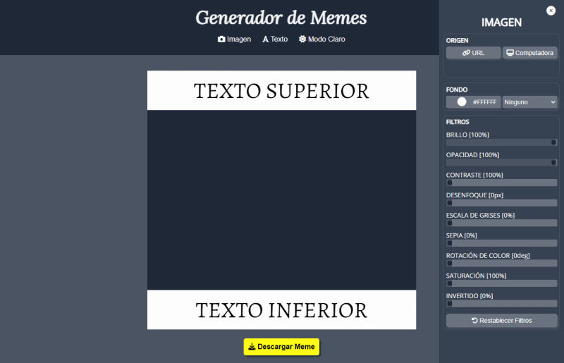

 

> [!NOTE]
> Si se minimiza el tamaño de la ventana, horizontalmente, el panel seleccionado se visualizará debajo de la sección principal, y aparecerán las flechas de desplazamiento `Arriba` y `Abajo`.

   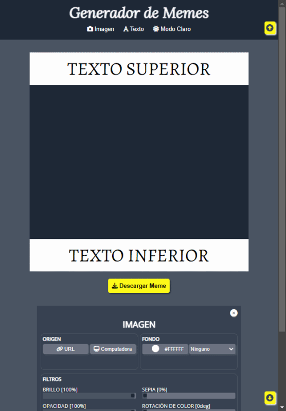

 

---

## *Mobile:*
[:top:](#tabla-de-contenidos)  
Todas las opciones de edición explicadas anteriormente, se encuentran disponibles para dispositivos móviles:

|Modo Oscuro| Modo Claro|
|:---:|:---:|
|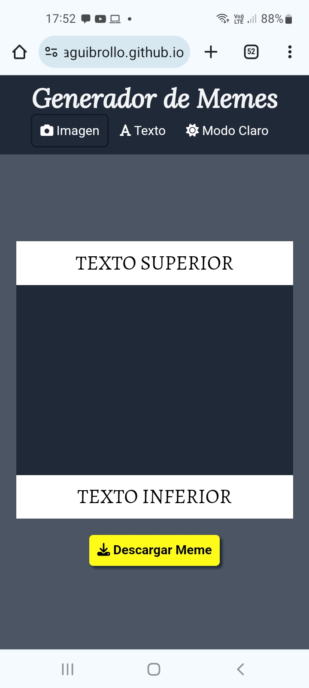|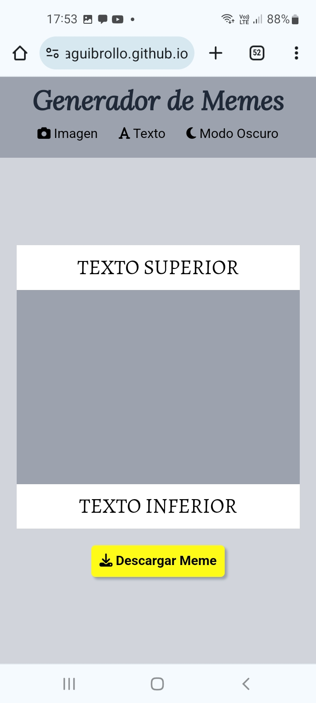|

 

|Panel de Imagen| Panel de Texto|
|:---:|:---:|
|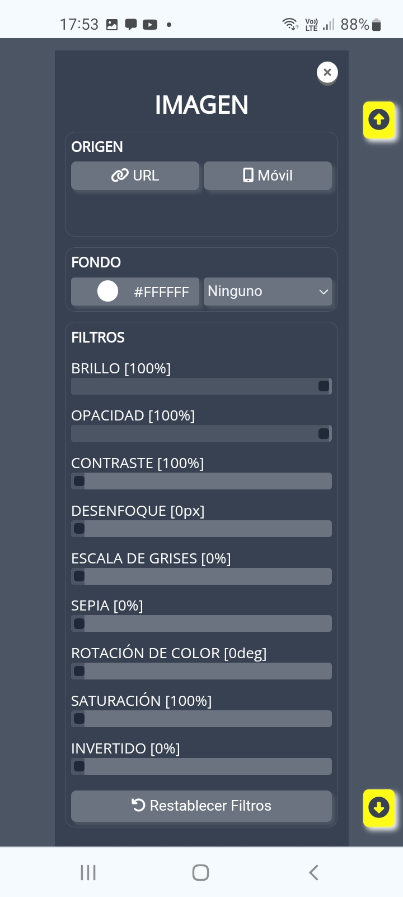|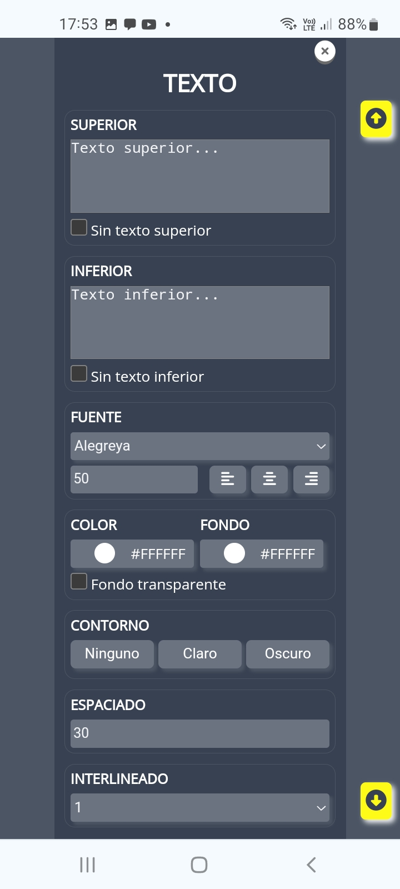|

 

|Flechas Up/Down | Edición|
|:---:|:---:|
|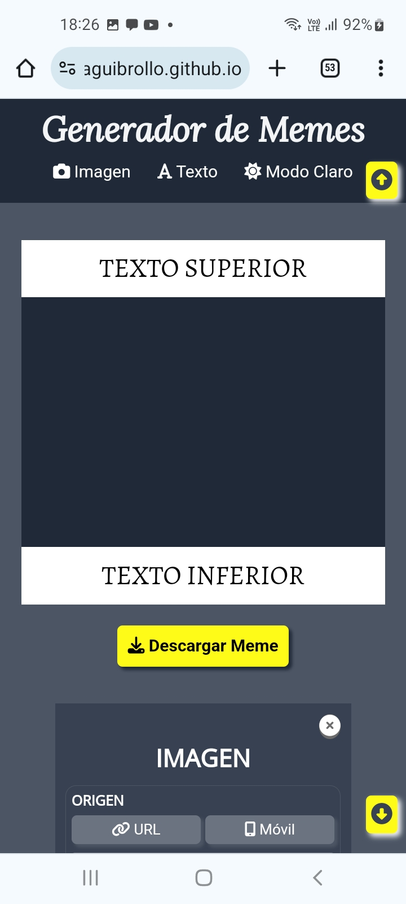|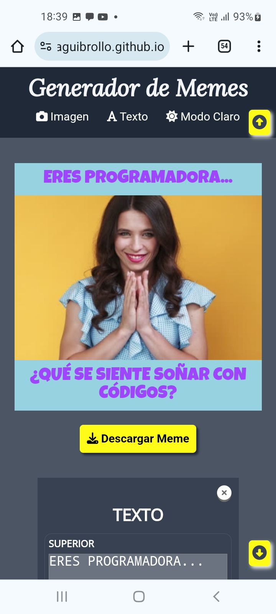|

 

|Pantalla Horizontal| 
|:---:|
|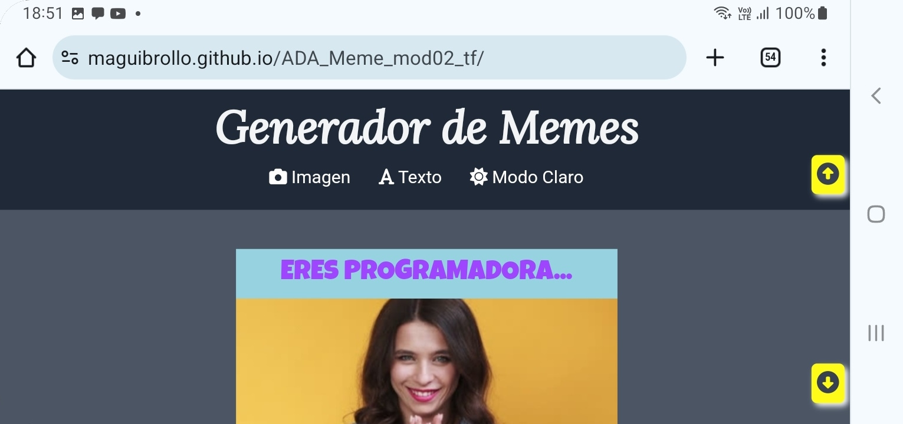|

| Edición Horizontal|
|:---:|
|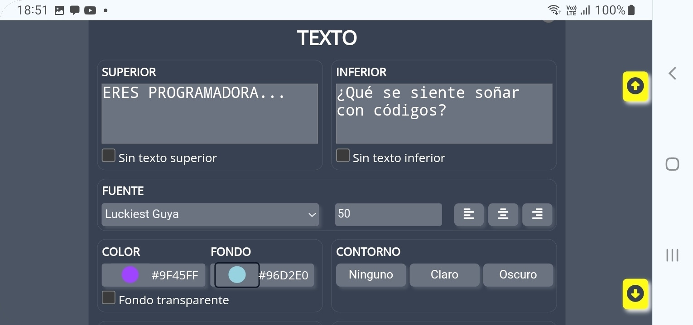|

 

---

## *Contáctame:*
[:top:](#tabla-de-contenidos)  

 

---
