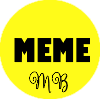

<!-- ===========================================================
                            PRESENTACIÓN 
     =========================================================== -->

   
 

 <h1 style="color: #FFFB19" align="center"> Generador de Memes </h1>
 

 <h3>Tabla de Contenidos:</h3>
 
- [Proyecto: Generador de Memes](#Generador-de-Memes)
- [Tecnologías](#Tecnologías)
- [Construcción](#Construcción)
- [Mobile](#Mobile)
- [Contáctame](#Contáctame)

<!-- ===========================================================
                            CONTENIDO 
     =========================================================== -->

## *Generador de Memes*

> El presente proyecto denominado `Generador de Memes` contempla el desarrollo de una App responsive adaptable a diferentes dispositivos móviles, como también a computadoras de escritorio.
Esta app permite que cualquier usuario pueda plasmar toda su creatividad al diseñar sus propios memes. Este generador de meme fue desarrollado como Trabajo Final del "Módulo 2 - JavaScript", de la capacitación de `"Desarrollo Frontend"` dictado por **ADA**. 
 

   

El proyecto, Generador de Memes, está incluido en mi Portfolio Personal, de tal manera de reflejar los avances en mi capacitación y perfeccionamiento.

> [!NOTE]
> Visite mi portafolio personal [PORTFOLIO](https://maguibrollo.github.io/ADA_Portafolio_mod01_tf/) 

 

:small_orange_diamond: 
## Tecnologías:
EL Generador de Meme fue desarrollado utilizando las siguientes tecnologías:  

| HTML   | CSS       | JavaScript   |  
| :---: | :---: | :---: |
|Es el lenguaje de marcado de hipertexto. Consiste en marcas basado en etiquetas que otorgan la estructura básica de la app.| Hojas de estilo en cascada. Son las declaraciones que otorgan estilos visuales al HTML.  | Lenguaje de programación. Otorga interactividad a las distintas secciones que conforman la app.|

## Construcción:
El Generador presenta una pantalla principal que contiene tres botones que permiten abrir el panel de edición de `Imagen`, abrir el panel de edición de `Texto`, e intercambiar entre `Modo claro` y `Modo Oscuro`.
Luego  se encuentra el sector de la vista previa del Meme, y por último el botón de `Descargar Meme`.
A continuación se detalla cada una de las secciones y paneles.

### *Secciones y Paneles*

- [Principal](#Panel-Principal)
- [Imagen](#Panel-de-Imagen)
- [Texto](#Panel-de-Texto)

#### Sección Principal:
(texto e imagenes Panel ppal)

#### Panel de Imagen:
(texto e imagenes Panel IMAGEN)

#### Panel de Texto:
(texto e img Panel TEXTO)

## *Mobile*
(capturas celu )

 

---
### *Contáctame:*

